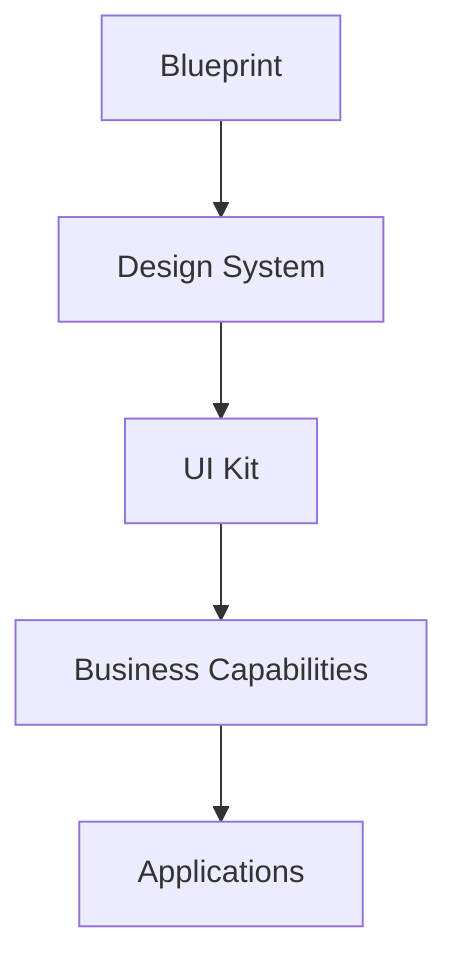

# UK-001 Relationship Model

## Purpose

This document defines the responsibility boundaries between Blueprint, Design System, UI Kit, Business Capabilities, and Applications.

## Layer Model



## Responsibility Boundaries

| Layer | Responsibility | Does Not Own |
| --- | --- | --- |
| Blueprint | Product and architecture principles. | UI implementation details. |
| Design System | Tokens, components, layouts, dashboard framework, interaction system, visualization, accessibility, theming. | Product-specific workflows or design language interpretation. |
| UI Kit | Design language, usage guidance, terminology, documentation standards, AI design guidance. | Component implementation or runtime behavior. |
| Business Capabilities | Domain workflows, business rules, capability-specific states, application services. | Shared visual system or reusable design language definitions. |
| Applications | Concrete user-facing product surfaces and runtime integration. | Platform governance or system-wide design contracts. |

## Authority Rules

When there is ambiguity:

1. Blueprint governs product and architecture principles.
2. Design System governs implementation contracts.
3. UI Kit governs language and usage guidance.
4. Business Capability docs govern domain workflows.
5. Applications govern concrete runtime composition.

## Cross-Reference Model

Use this pattern when documenting relationships:

```text
Blueprint:
Defines why the system exists and what principles constrain it.

Design System:
Defines implementation-ready UI primitives and contracts.

UI Kit:
Defines how those primitives should be described and applied.

Business Capability:
Defines domain-specific workflow and business meaning.

Application:
Assembles the approved pieces into a concrete product surface.
```

## Example

```text
Customer Dashboard

Blueprint:
Must help operators make better business decisions.

Design System:
Provides dashboard, widget, card, interaction, visualization, accessibility, and theme contracts.

UI Kit:
Defines the dashboard as an operational summary interface and standardizes terminology.

Business Capability:
CAP-002 CRM defines customer, lead, interaction, follow-up, search, import, export, and integration workflows.

Application:
Renders the concrete CRM customer dashboard.
```
